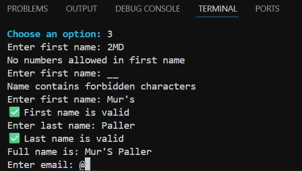

# MongoDB Practice Project

    ☃︎ ⋆  ❆ .ೃ ࿔*  𖠰 🎁 .𐙚  *  .
    Welcome to Christmas Gifts DB! *   .
    A practice project for people and
    gift tracking. 🎄 🎅*  .  .       
    .   *    .   *  .   *   .      

**Course:** Introduction to NoSQL Databases - SOF012AS2AE-3001

**Creator:** Jonna Isosaari

This is a Python practice project for **CRUD operations** using **MongoDB** and my own **practice database**.

At this stage, the project should include all the required features to pass the course.

**Small demo gif** 

 Additional improvements and personal features will be added later as I continue learning.

### Current main commands:
  0) Exit program
  1) List/search people
  2) List gifts
  3) Add a person
  4) Add a gift
  5) Edit person details
  6) Edit gift details
  7) Delete a person
  8) Delete a gift   

Here are some features that I may add later. More ideas will likely come up while testing the application. 

| Feature | Status |
|---|---|
| Ability to edit several fields at once for people and gifts, with a confirmation step | Will be added later |
| Search people when editing or deleting, so you don’t need to remember ObjectId values | Will be added later |
| More colors and clearer CLI output | Will be added later |
| Assign gifts to people | Will be added later |
| View which gifts are assigned to each person | Will be added later |
| Split the project into multiple `.py` files for better structure | Will be added later |
| Code refactoring and cleanup | Will added later |

**ER diagram**

References: 

*Emojis: 
https://gist.github.com/rxaviers/7360908* 
*ASCII art inspired by: 
https://emojicombos.com/christmas-tree*

W3Schools Python MongoDB Materials
/ course materials